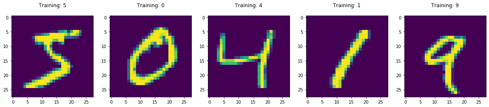
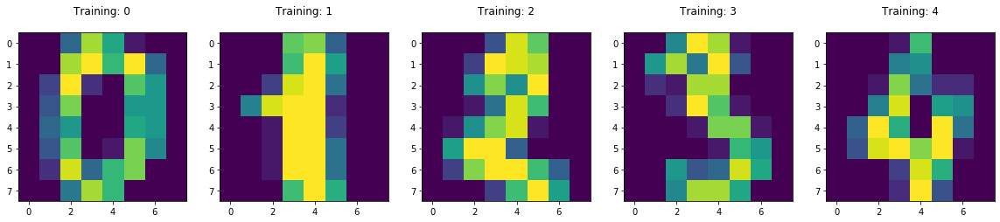

# Digit Recognition Model

 

The purpose of this project is to build a classification model that can recognize digits as accurately as possible. The datasets used for this project are the sklearn's mnist and digits dataset.
